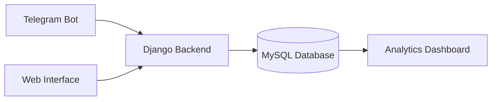

# CreatingTests: Система автоматизированного тестирования

[](https://python.org)
[](https://djangoproject.com)

**Дипломный проект** | Университетская программа | 🎓 Академический проект

Комплексная система для проведения автоматизированного тестирования студентов, объединяющая:
- 🤖 Telegram-бот для прохождения тестов
- 💻 Веб-интерфейс для преподавателей
- 📊 Систему аналитики результатов

## 🎯 Решаемые проблемы
1. **Для преподавателей**:
   - Сокращение времени на проверку тестов
   - Автоматизация создания тестовых заданий
   - Централизованное хранилище результатов
2. **Для студентов**:
   - Удобное прохождение тестов в привычном мессенджере
   - Мгновенные результаты проверки
   - Доступ к истории попыток

## ⚙️ Архитектура системы


## 🛠️ Технологический стек
Backend
- Python 3.10+
- Django 4.2 (веб-фреймворк)
- Django REST Framework (API)
- Celery (асинхронные задачи)
- MySQL (хранение тестов и результатов)
- Redis (кеширование и брокер сообщений)

Telegram Bot
- python-telegram-bot 20.x (библиотека для бота)
- PyMySQL (интеграция с MySQL)
- Jinja2 (генерация шаблонов)

Frontend (Web Interface)
- HTML5/CSS3 (базовые технологии)
- Bootstrap 5 (адаптивный дизайн)
- Chart.js (визуализация статистики)
- Django Templates (рендеринг)

## Установка

1. **Склонируйте репозиторий:**
   ```bash
   git clone https://github.com/ваш-репозиторий.git
   ```
2. **Перейдите в директорию проекта:**

   ```bash
   cd ваш-проект
   ```
3. **Создайте виртуальное окружение:**

   ```bash
   python -m venv venv
   ```
4. **Активируйте виртуальное окружение:**

   - **На Windows:**

   ```bash
   venv\Scripts\activate
   ```
   - **На macOS/Linux:**
  
   ```bash
   source venv/bin/activate
   ```
5. **Установите зависимости:**

   ```bash
   pip install -r requirements.txt
   ```
6. **Настройте базу данных:**

   - **Создайте базу данных MySQL.**
  
   - **Обновите настройки в settings.py:**

   ```python
   DATABASES = {
       'default': {
           'ENGINE': 'django.db.backends.mysql',
           'NAME': 'ваша_база_данных',
           'USER': 'ваш_пользователь',
           'PASSWORD': 'ваш_пароль',
           'HOST': 'localhost',
           'PORT': '3306',
       }
   }
   ```
7. **Примените миграции:**

   ```bash
   python manage.py migrate
   ```
8. **Запустите сервер:**

   ```bash
   python manage.py runserver
   ```
## Использование
Откройте браузер и перейдите по адресу http://127.0.0.1:8000/.

##🌟 Ключевые функции
### Для преподавателей (веб-интерфейс)
- Создание тестов
- Назначение тестов группам студентов
- Просмотр статистики по результатам
- Управление банком вопросов

### Для студентов (Telegram-бот)
- 📝 Список доступных тестов
- 📊 Мгновенные результаты
- 🔔 Уведомления о новых тестах

## 🎓 Академическая значимость
Проект демонстрирует:
1. Интеграцию разнородных систем (мессенджер + веб)
2. Реализацию сложной бизнес-логики тестирования
3. Обработку и визуализацию образовательных данных
4. Создание масштабируемой архитектуры
5. Практическое применение Django ORM для сложных запросов

## 📈 Потенциальные улучшения
1. Интеграция с LMS системами (Moodle, Open edX через LTI)
2. Система проверки текстовых ответов с использованием NLP
3. Плагин для браузера для защиты от списывания
4. Мобильное приложение для преподавателей
5. Геймификация тестирования (бейджи, рейтинги)

## 👩‍💻 Автор

Елена Завадская

Дипломный проект по специальности "Разработка программно-информационных систем в глобальной экономике"

[GitHub профиль](https://github.com/elena-zavadskaya)
